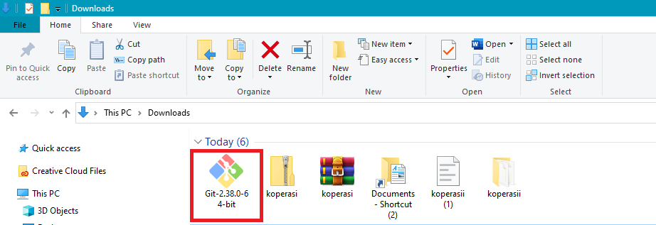
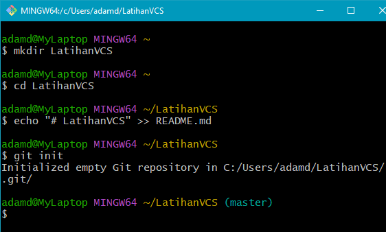
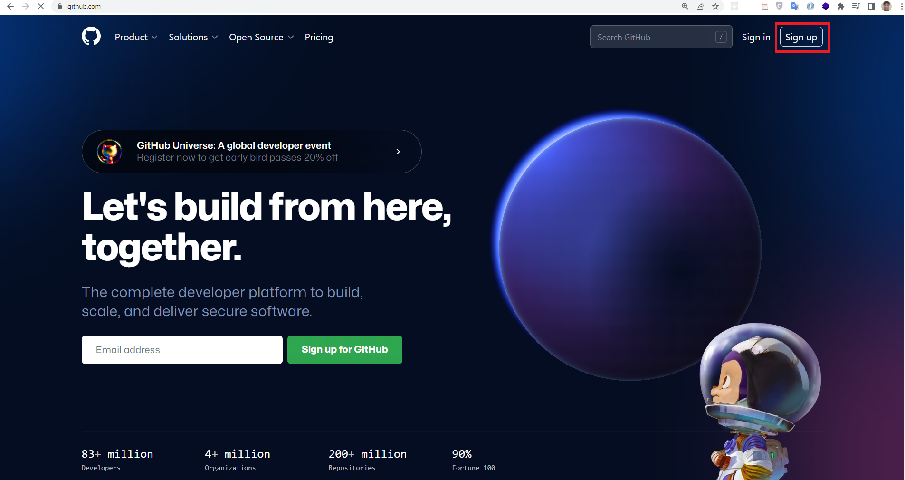
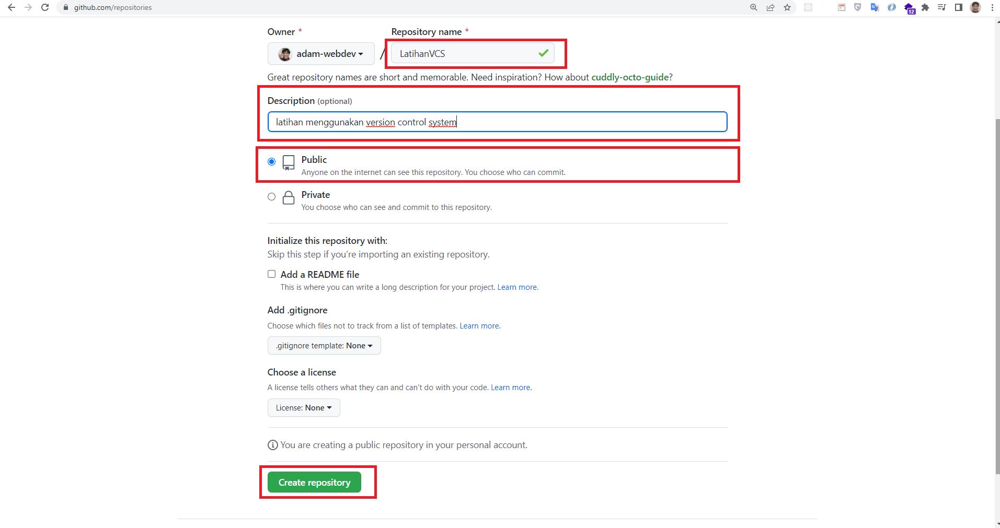
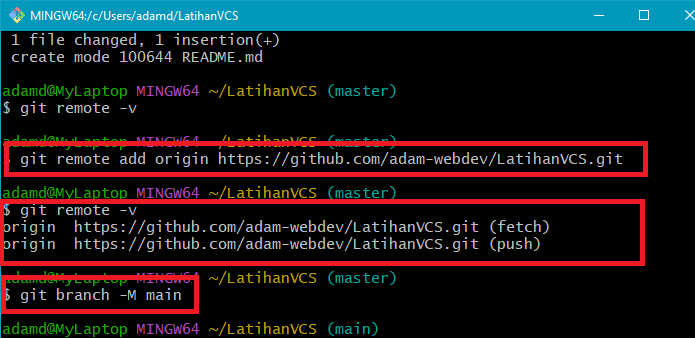
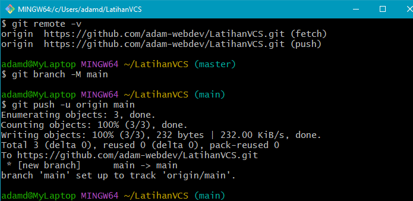
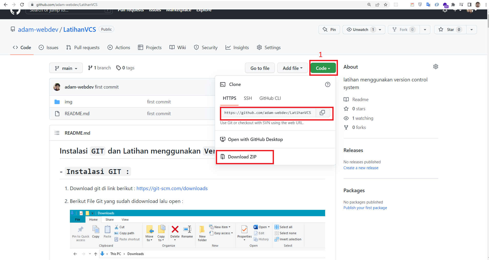
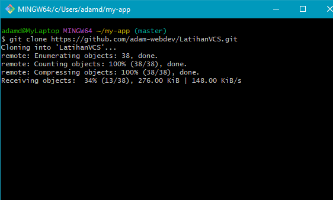
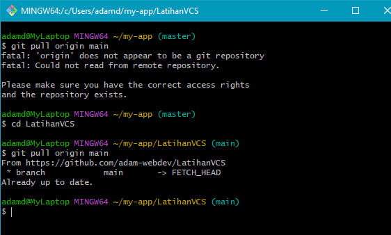

## Instalasi `GIT` dan Latihan menggunakan `Version Control System`

## - `Instalasi GIT :`

1. Download git di link berikut : [https://git-scm.com/downloads](https://git-scm.com/downloads)
2. Berikut File Git yang sudah didownload lalu open :

   

3. Maka akan muncul infomasi lisensi Git, klik Next > untuk melanjutkan.

    

4. Selanjutnya menentukan lokasi instalasi. Biarkan saja apa adanya, kemudian klik Next >.

    

5. Selanjutnya pemilihan komoponen, biarkan saja seperti ini kemudian klik Next >.

    

6. Selanjutnya pemlilihan direktori start menu, klik Next >.

    

7. Selanjutnya pengaturan PATH Environment. Pilih yang tengah agar perintah git dapat di kenali di Command Prompt (CMD). Setelah itu klik Next >.

    

8. Selanjutnya konversi line ending. Biarkan saja seperti ini, kemudian klik Next >.

    

9. Selanjutnya pemilihan emulator terminal. Pilih saja yang bawah, kemudian klik Next >.

    

10. Selanjutnya pemilihan opsi ekstra. Klik saja Next >.

    

11. Selanjutnya pemilihan opsi ekspreimental, langsung saja klik Install untuk memulai instalasi.

    

12. Tunggu beberapa saat, instalasi sedang dilakukan.

    

13. Setelah selesai, kita bisa langsung klik Finish.

    

## `Cara Pengguanan GIT :`

1. Pertama kita harus Konfigurasi global akun yaitu name dan email agar tidak eror ketika git commit :
    - `git config --global user.name “name”`
    - `git config --global user.email "email"`

     

     

2. Membuat repository / folder baru dan masuk repository tersebut dengan masukan perintah sebagai berikut :

    - `mkdir LatihanVCS`
    - `cd LatihanVCS`

     

     

3. Selanjutnya kita akan membuat file baru bernama README.md :

    - `echo "# LatihanVCS" >> README.md`

     

4. Lalu kita inisialisasi dengan perintah berikut :

    - `git init`

      

5. Setelah itu kita akan melihat status dari file tersebut :

    - `git status`

      

      Terlihat disitu terdapat file README.md yang belum di tambahkan yang bertulis dengan warna merah

6. Untuk menambahkan file tersebut / perubahan pada file
   pada staging sebelum proses commit. ketikan perintah berikut

   Lalu cek kembali status file tersebut jika sudah sukses di tambahkan tulisan file berwarna hijau

    - `git add "README.md"`
    - `git status`

      

7. Setelah itu simpan perubahan / penambahan yang terjadi dengan
   mengetikan perintah berikut :

    - `git commit -m "first commit"`
    - `git remote -v` => untuk mengecek sudah terhubung dengan url server git

      

      Perubahan / penambahan pada repository berhasil disimpan didatabse lokal,
      Jika kita ingin menyimpannya diserver repository
      silahkan kunjungi link berikut : [https://github.com](https://github.com)

8. Lalu akan muncul tampilan sebagai berikut :

      

      Silahkan login jika sudah memiliki akun namun jika belum silahkan daftar terlebih dahulu :

9. Lalu akan muncul tampilan sebagai berikut silahkan daftar :

      

    Sampai semua ceklis berwarna hijau
    Jika sudah klik Continue

10. Membuat Repository baru digithub klik tombol create or new yang  berwarna hijau :

      

11. Lalu akan tampil halaman berikut silahakan diisi nama repository sesuai keinginan kalian:

      

    - Public => repository dapat dilihat oleh semua orang
    - Private => repository dibatas tidak semua orang bisa melihat

12. Jika Berhasil akan muncul tampilan sebagai berikut :

      

    - 1 Untuk menyimpan repository jika di komputer lokal belum ada
    - 2 Untuk membuat repository jika di komputer lokal sudah ada dan tersimpan kalian tinggal ikutin perintahnya
    -
13. Baik sekarang kita akan push repository lokal kita ke github pertama kita lakukan remote sebagai berikut :

    - `git remote add origin https://github.com/adam-webdev/LatihanVCS.git`

    Lalu cek status remote apakah berhasil :

    - `git remote -v`

    Lalu kita bisa atur branch repository kita dengan menjalankah perintah berikut :

    - `git branch -M main`

      

14. Selanjutnya kita push dengan menggunakan perintah  :

    - `git push -u origin main`
    - `origin` adalah nama remote yang tadi kita buat
    - `main` adalah branch repository kita

      

    - Kita sudah berhasil menyimpan repository kita di `GITHUB`

15. Jika kita ingin menggunakan repository yang telah ada di Github kita bisa mendownload atau mengclone pertama klik `code` berwarna hijau lalu copy url https repository kita :

      

    Berikut perintah untuk menggunakan git clone :
    - `git clone https://github.com/adam-webdev/LatihanVCS.git `

      

    - Masuk kerepository dengan cara `cd LatihanVCS`

    Setelah itu jangan lupa untuk melakukan pull untuk mengetahui perubahan yang terakhir dilakukan

    - `git pull origin main `

      

    - Atau anda juga bisa mendownload langsung dengan memilih download zip

      

